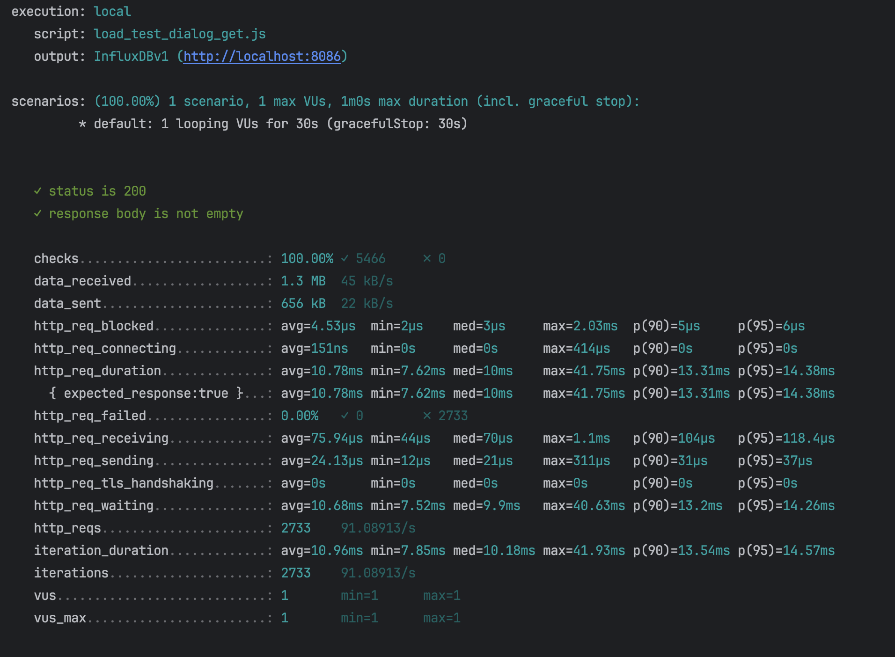
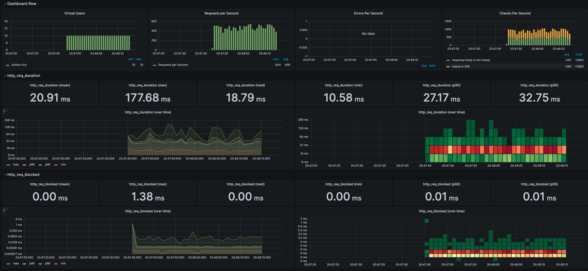
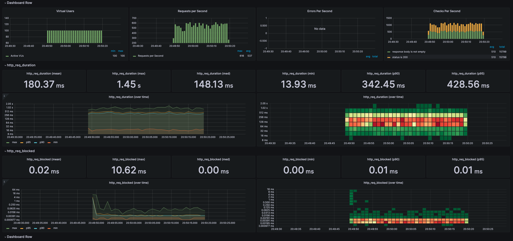
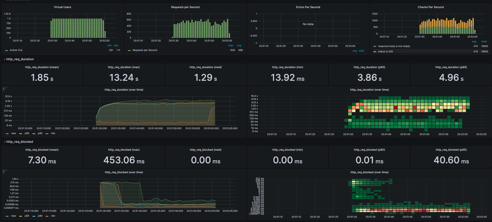
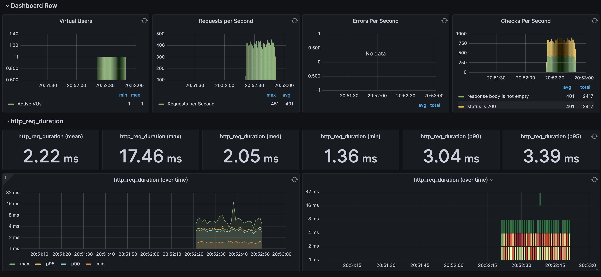
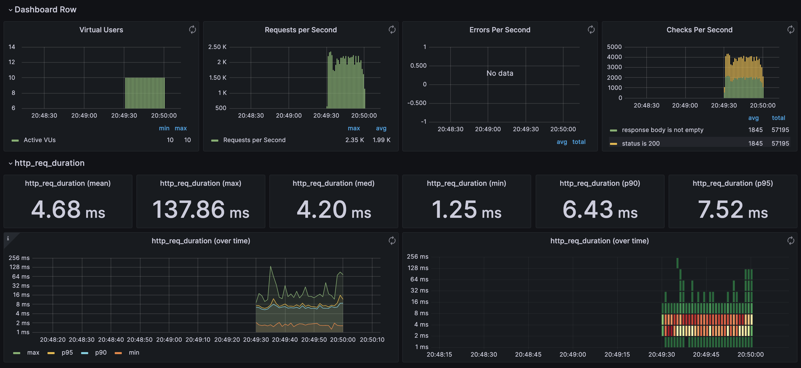
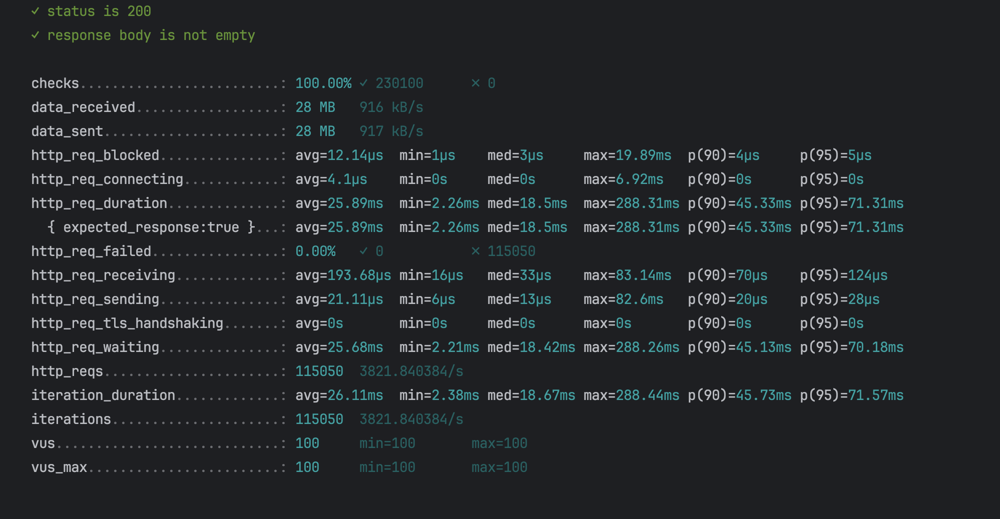
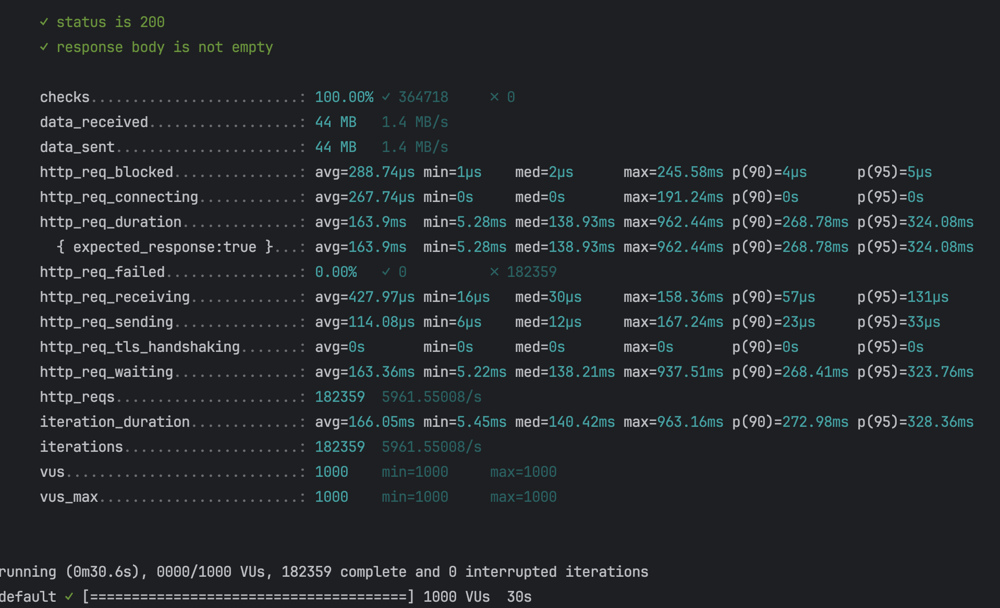

Нагрузочное тестирование модуля Диалоги (чтение)
========================================
Тестирование:
- 1 пользователь, 30 секунд
- 10 пользователей, 30 секунд
- 100 пользователей, 30 секунд
- 1000 пользователей, 30 секунд

Результаты:
- 1 пользователь, 30 секунд
  
  .png)
- 10 пользователей, 30 секунд
  
  .png)
- 100 пользователей, 30 секунд
  
  .png)
- 1000 пользователей, 30 секунд
  
  .png)

Нагрузочное тестирование модуля Диалоги Tarantool + lua (чтение)
========================================
Результаты:
- 1 пользователь, 30 секунд
  .png)
  
- 10 пользователей, 30 секунд
  .png)
  
- 100 пользователей, 30 секунд
  
  .png)
- 1000 пользователей, 30 секунд
  
  .png)