# **До индекса** 

**1 юзер 30 секунд**

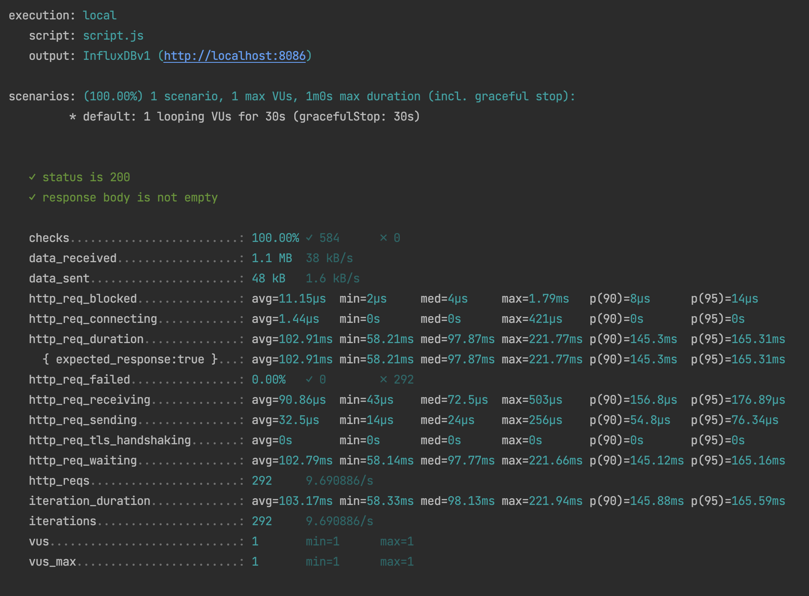

**10 юзеров 30 секунд**

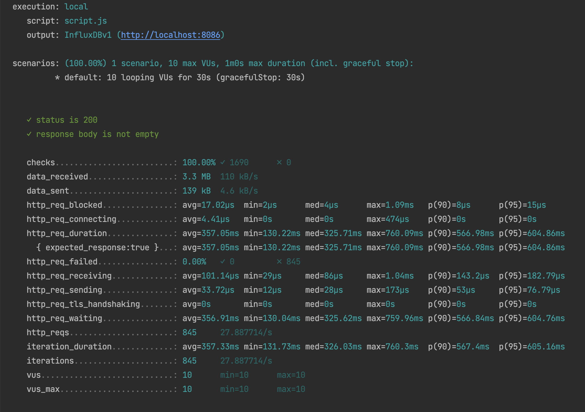

**100 юзеров 30 секунд**

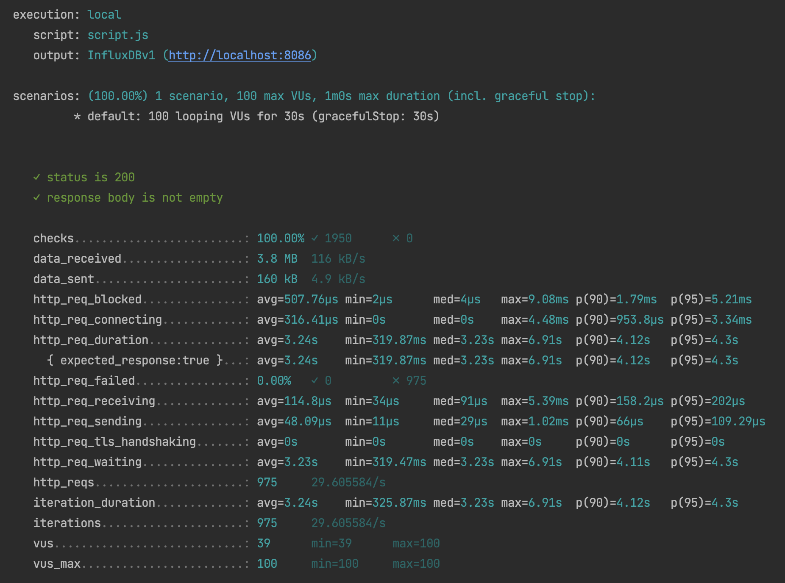

**1000 юзеров 30 секунд**

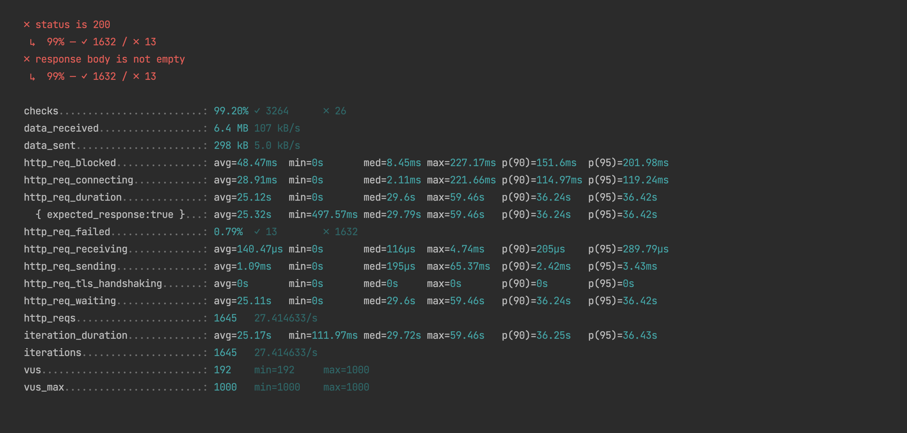


**http_req_duration**
_(смотреть с 21:14, порядок тестирования 100, 10, 1, 1000)_

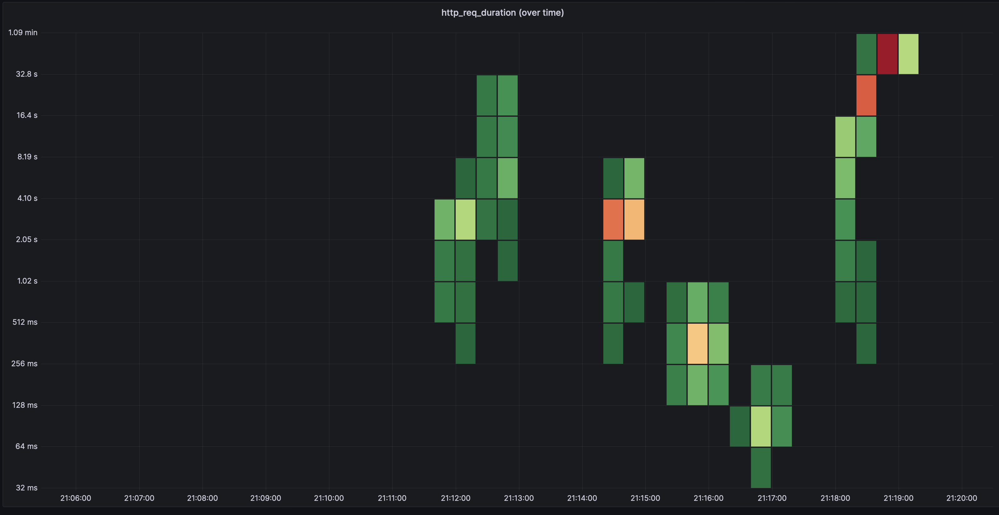

**Explain запроса**

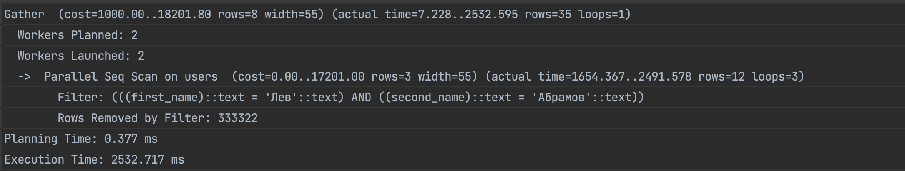

**Запрос добавления индекса**
    
    ```sql  CREATE INDEX CONCURRENTLY first_last_name_idx ON users (first_name, second_name); ```

**Объяснение использования индекса**

Для поиска по имени и фамилии в таблице пользователей был выбран составной индекс CREATE INDEX CONCURRENTLY first_last_name_idx ON users (first_name, second_name).

При выборе индекса для поиска по двум полям, необходимо учитывать, что запрос будет использовать оператор LIKE, который выполняет поиск по шаблону и может быть довольно ресурсоемким. Поэтому для оптимальной производительности поиска следует создать индекс, который будет покрывать оба поля, на которых выполняется поиск.

В данном случае, составной индекс на полях first_name и second_name обеспечивает оптимальную производительность запроса, так как он позволяет БД быстро отфильтровать строки, удовлетворяющие поисковому шаблону, и избежать полного сканирования таблицы. Также, использование ключей индекса при выполнении запроса может ускорить чтение данных, так как PostgreSQL может использовать этот индекс для выполнения операции ORDER BY при сортировке результатов запроса.

Использование ключевого слова CONCURRENTLY позволяет создать индекс без блокировки таблицы на запись, что позволяет продолжать работу с таблицей во время создания индекса. Это полезно для таблиц большого размера, где создание индекса может занять много времени и привести к значительным задержкам в работе с таблицей.

# После индекса

**1 юзер 30 секунд**

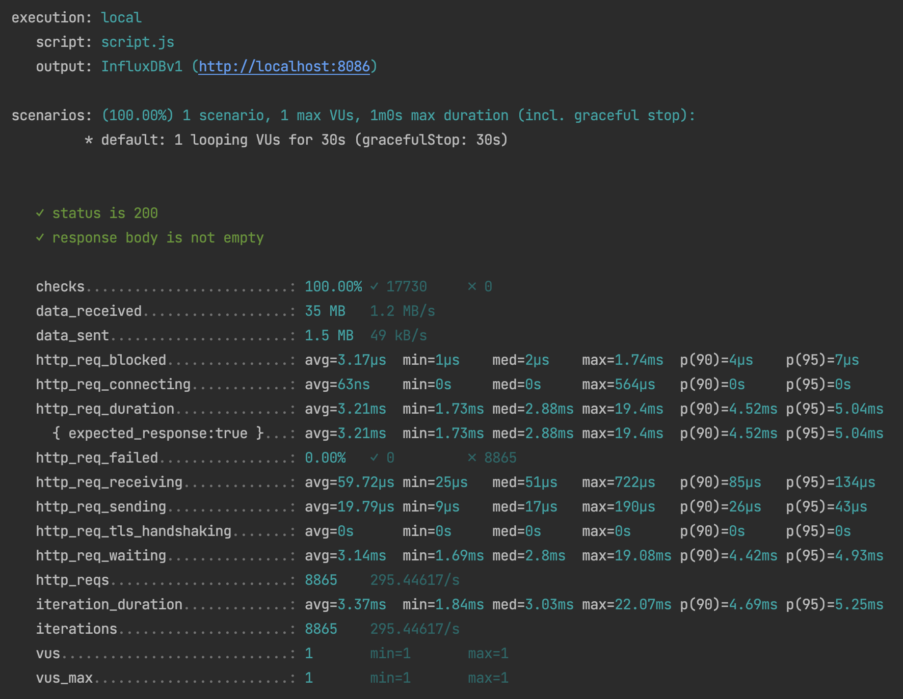

**10 юзеров 30 секунд**

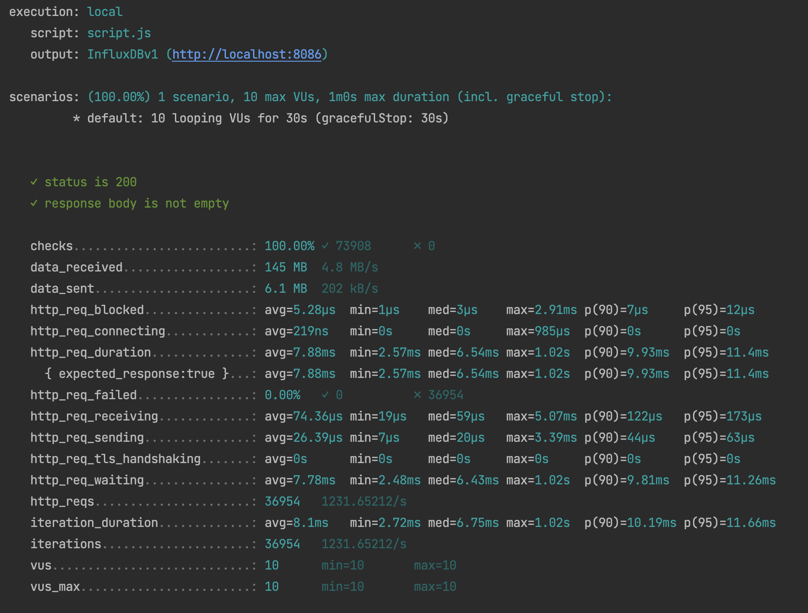

**100 юзеров 30 секунд**

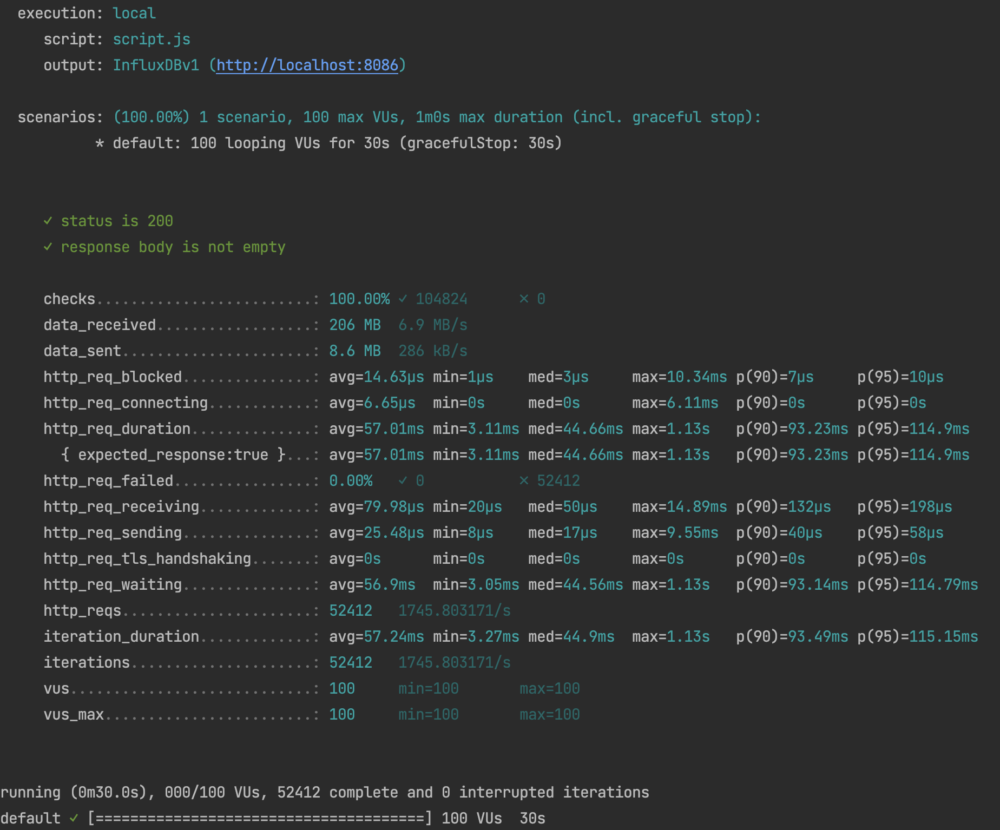

**1000 юзеров 30 секунд**

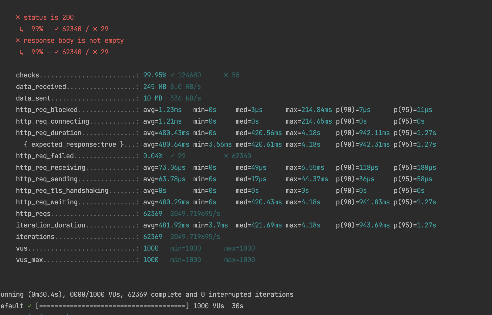

**http_req_duration**
_(порядок тестирования 1,10,100,1000)_

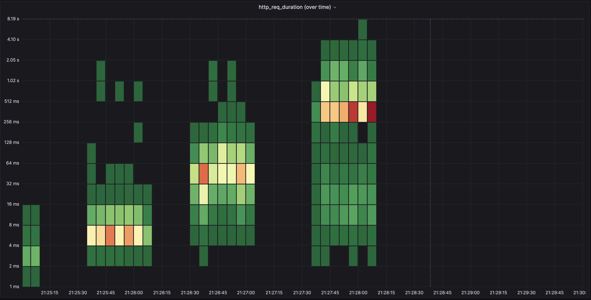

**Explain запроса**

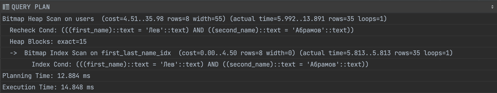


