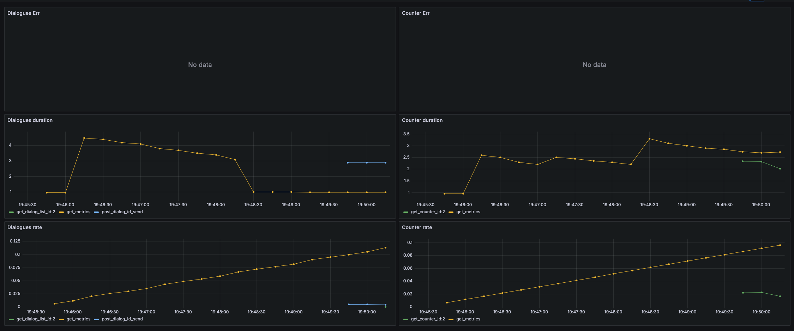
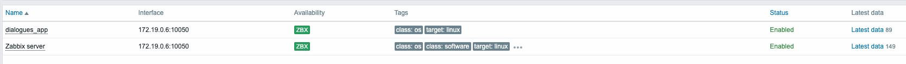
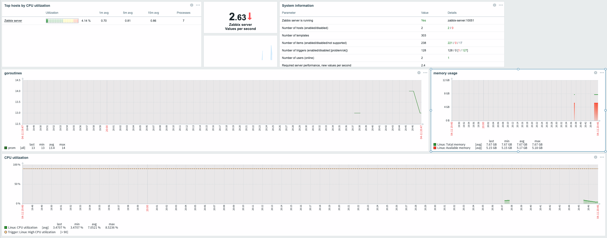

# Мониторинг

### Grafana + Prometheus
- Добавил в docker-compose.yml сервисы prometheus и grafana
- Сперва сделал эндпоинты для сервисов counter_app и dialogues_app которые отдают метрики по /metrics
- Добавил в prometheus.yml конфигурацию для сбора метрик с этих эндпоинтов
- Добавил в grafana дашборды для этих метрик (по принципу RED)

### Zabbix
- Добавил в docker-compose.yml сервис zabbix
- Поднял zabbix и настроил мониторинг для хоста dialogues_app

- Дополнительно добавил item в Data collection который так же мониторит dialogues_app/metrcis и регуляркой процессит сетрику горутин
- Указал template для мониторинга (Linux servers by Zabbix agent)
- Добавил мониторинг для технических метрик (память, диск)
