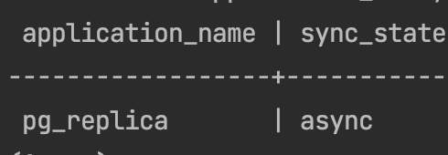
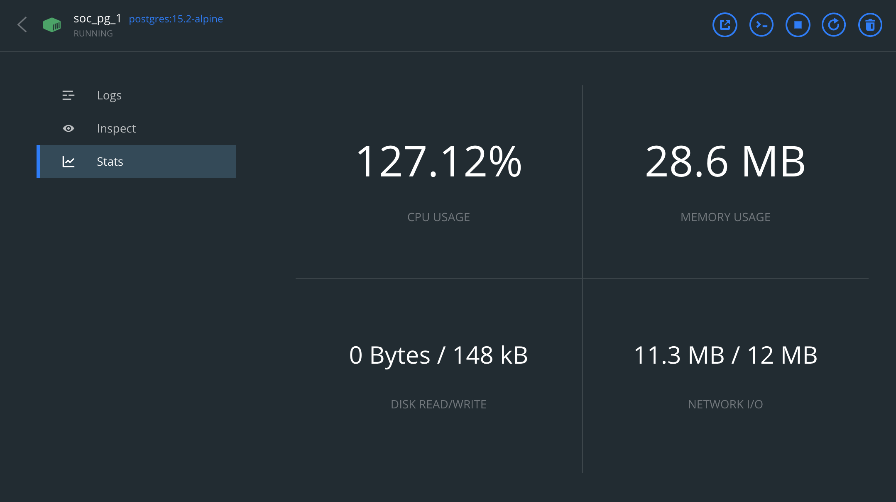
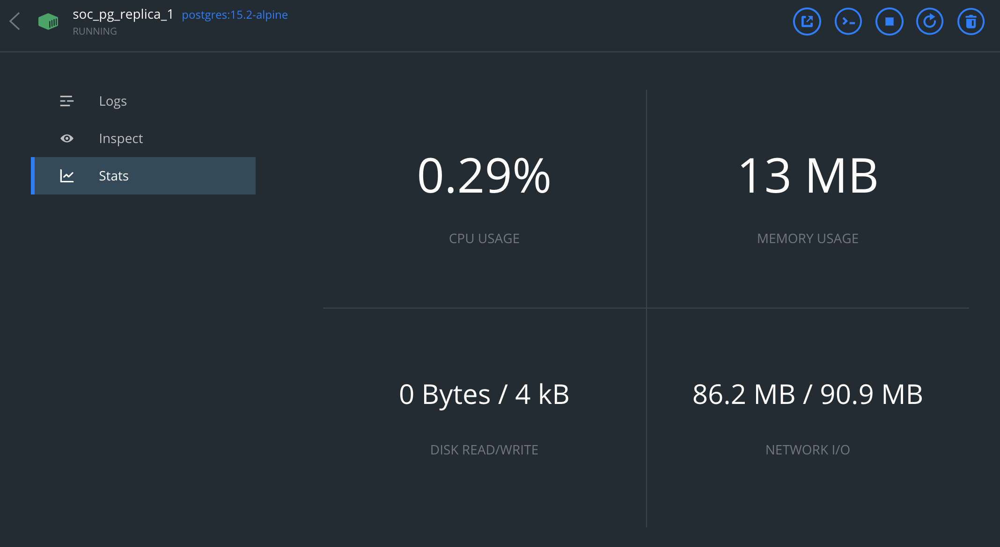
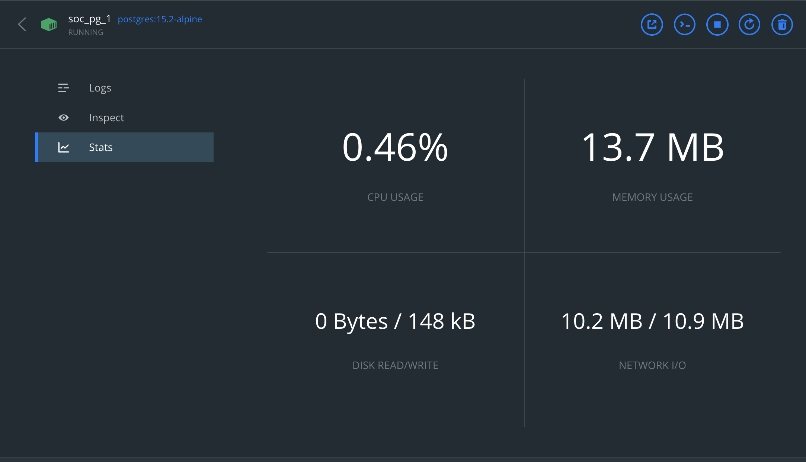
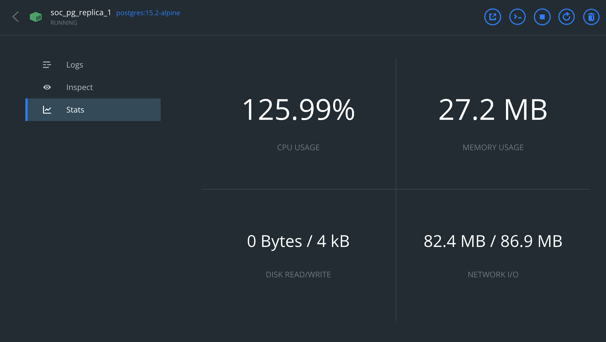
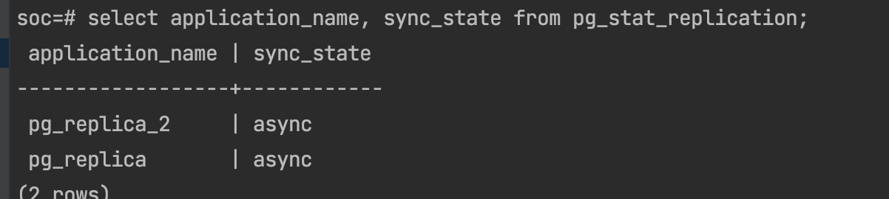
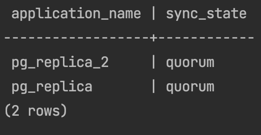
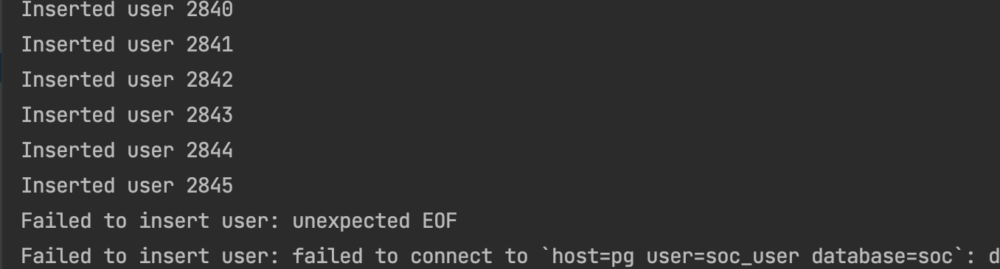
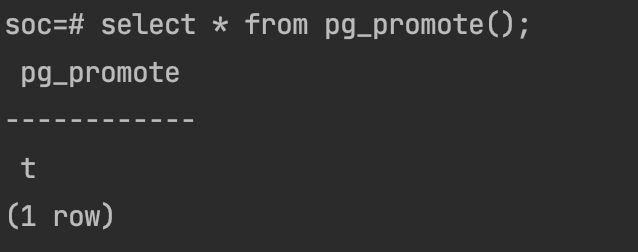
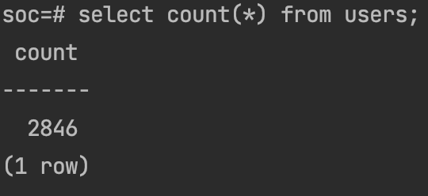

# 1.Настройка асинхронной репликации
Для этого пришлось обновить docker compose следующим образом:
```yaml
  pg:
    image: postgres:15.2-alpine
    environment:
      POSTGRES_USER: soc_user
      POSTGRES_PASSWORD:
      POSTGRES_DB: soc
      SERVICE_NAME: pg
      POSTGRES_HOST_AUTH_METHOD: trust
      POSTGRES_INIT_DB_ARGS: "--locale=ru_RU"
      PAGER: less
      TERM: xterm
    expose:
      - "5432"
    ports:
      - "5432:5432"
    volumes:
      - data:/var/lib/postgresql
      - ./.docker/conf/pg/pg_hba.conf:/var/lib/postgresql/data/pg_hba.conf
      - ./.docker/conf/pg/postgresql.conf:/var/lib/postgresql/data/postgresql.conf
    networks:
     - soc

  pg_replica:
    image: postgres:15.2-alpine
    environment:
      POSTGRES_USER: soc_user
      POSTGRES_PASSWORD:
      POSTGRES_DB: soc
      SERVICE_NAME: pg_replica
      POSTGRES_HOST_AUTH_METHOD: trust
      POSTGRES_INIT_DB_ARGS: "--locale=ru_RU"
      PAGER: less
      TERM: xterm
    ports:
      - "5433:5432"
    volumes:
      - ./.docker/conf/pgslave_hehe:/var/lib/postgresql/data
    networks:
      - soc
```

В файле `postgresql.conf` добавил следующие строки:
```conf
ssl = off
wal_level = replica
max_wal_senders = 4 # expected slave num
```

В файле `pg_hba.conf` добавил нашу подсеть
После того как в pg мы создали роль с необходимыми для репликации правами, сняли дамп базы.
Внесли изменения в `postgresql.conf` на реплике, добавили строку:
```conf
primary_conninfo = 'host=pg port=5432 user=replicator password=pass application_name=pg_replica'
```
Также создали файл standby.signal в папке с данными реплики.

После этого запустили реплику и убедились, что она подключилась к мастеру.


# 2. Перенос запросов на чтение со слейва
Для этого в приложении создаем новое соединение для реплики и прокидываем его в репозиторий.
Пример обращения к базе из метода getUser.
Стало так:
```go
row := u.dbRep.QueryRow(ctx, query, userId)
```
Было так:
```go
row := u.db.QueryRow(ctx, query, userId)
```

# 3. Нагрузочное тестирование
Для этого я воспользовался старым скриптом k6s из предыдущего ДЗ.
Для начала я запустил тесты на pg чтобы определить что нагрузка идет именно на мастер


После этого прогнал тесты на реплике, чтобы убедиться, что нагрузка перешла на нее.


# Настройка 2 слейвов и 1 мастера
Для этого я воспользовался старым docker-compose файлом, который я использовал для настройки репликации.
Добавил туда еще одну реплику и поменял порты.
```yaml
    pg_replica_2:
    image: postgres:15.2-alpine
    environment:
      POSTGRES_USER: soc_user
      POSTGRES_PASSWORD:
      POSTGRES_DB: soc
      SERVICE_NAME: pg_replica
      POSTGRES_HOST_AUTH_METHOD: trust
      POSTGRES_INIT_DB_ARGS: "--locale=ru_RU"
      PAGER: less
      TERM: xterm
    ports:
      - "5434:5432"
    volumes:
      - ./.docker/conf/pgslave_2:/var/lib/postgresql/data
    networks:
      - soc
```
Остальная настройка была аналогична настройке 1 реплики. 
В итоге зайдя на мастер используя запрос `select application_name, sync_state from pg_stat_replication;` мы получили следующий результат:


# 4. Настройка кворумной синхронной репликации
для этого добавим в `postgresql.conf` на мастере следующие строки:
```conf
synchronous_commit = on
synchronous_standby_names = 'ANY 1 (pg_replica, pg_replica2)'
```
После этого перезапустим мастера и реплики. (для применения конфига можно воспользовать запросом `select pg_reload_conf();`)
В итоге при проверке на мастере `select application_name, sync_state from pg_stat_replication;` мы получили следующий результат:


# 5. Создание нагрузки на запись в мастере и эксперимент с транзакциями
Для этого я воспользовался функцией `upload` который располагается в main.go, который изначально предназначался для записи миллиона сотрудников в базу. Добавил туда счетчик успешных записей.

После этого убил мастер с помощью команды `docker kill`
Запромоутил вторую реплику

Добавил signal.standby на мастер и добавил новый primary_conninfo на вторую реплику.
Аналогично добавил primary_conninfo на первую реплику.

При записи мы получили картину по записям:


После промоута до мастера реплики, получили следующий результат в таблице

при учете что в таблице уже была 1 запись, потерь не было.